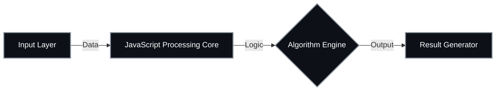

<div align="center">


<p align="center">
  
  
  
  
</p>


</div>

---

## Overview

> Custom-built web browser engine using CEF and C++.

**Browser Project** is a proprietary general system engineered by **Karthik Idikuda**. 

<br/>

## System Architecture



<br/>

## Project Structure

```
Browser-Project/
  .env.example
  .gitignore
  LICENSE
  README.md
  jest.config.js
  logo.png
  package-lock.json
  package.json
  .github/
  electron/
    main.js
    preload.js
  src/
    index.html
    renderer.js
  tests/
    llm.test.js
```

<br/>

## Technical Specifications

| Attribute | Detail |
|:---|:---|
| **Primary Language** | `JavaScript` |
| **Project Category** | `General` |
| **Total Source Files** | `20` |
| **Frameworks** | `Native` |
| **Key Dependencies** | `electron-builder` | `@cliqz/adblocker-electron` | `electronmon` | `cross-fetch` | `sql.js` | `jest` | `electron` | `dotenv` |
| **Intellectual Property** | `Strictly Proprietary` |

<br/>

## STRICT LEGAL WARNING & LICENSE

> **PROPRIETARY AND CONFIDENTIAL**

This software and all associated documentation are the **exclusive property of Karthik Idikuda**.

- **NO PERMISSION IS GRANTED** to use, copy, modify, merge, publish, distribute, sublicense, or sell copies of this software without explicit, written consent from the author.
- **UNAUTHORIZED USE WILL RESULT IN SEVERE LEGAL ACTION.** Any individual or organization found using, referencing, or deploying this code without paying the required licensing fees will face immediate litigation, financial penalties, and potentially criminal prosecution where applicable by law.
- **TO OBTAIN A LEGAL LICENSE**, you must directly contact Karthik Idikuda to negotiate payment terms.

*By accessing this repository, you acknowledge and accept these strict proprietary terms.*

---

<div align="center">
  
</div>

<!-- TRACKING: S0ktQnJvd3Nlci1Qcm9qZWN0LVRSQUNL -->
